# Усі версії та прев’ю

«Є» означає наявність файла в отриманому архіві. Windows-інсталятори не запускалися. Палець пробілу прочитано з імпорту KLANext. Відсутні прев’ю можна додати пізніше.

| Версія | KLANext | Пробіл | MSKLC | Windows ZIP | Прев’ю |
| --- | --- | --- | --- | --- | --- |
| ergoLAY0 | [TXT](../layouts/early/ergoLAY0/ergoLAY0.uk.ansi.txt) | правий | — | — | [PNG](../layouts/early/ergoLAY0/ergoLAY0.png) |
| ergoLAY2 | [TXT](../layouts/early/ergoLAY2/ergoLAY2.uk.ansi.txt) | правий | — | — | [PNG](../layouts/early/ergoLAY2/ergoLAY2.png) |
| ergoLAY3 | [TXT](../layouts/early/ergoLAY3/ergoLAY3.uk.ansi.txt) | лівий | — | — | [PNG](../layouts/early/ergoLAY3/ergoLAY3.png) |
| ergoLAY4 | [TXT](../layouts/early/ergoLAY4/ergoLAY4.uk.ansi.txt) | лівий | — | — | [PNG](../layouts/early/ergoLAY4/ergoLAY4.png) |
| ergoLAY5 | [TXT](../layouts/early/ergoLAY5/ergoLAY5.uk.ansi.txt) | лівий | — | — | [PNG](../layouts/early/ergoLAY5/ergoLAY5.png) |
| ergoLAY6 | [TXT](../layouts/early/ergoLAY6/ergoLAY6.uk.ansi.txt) | лівий | — | — | [PNG](../layouts/early/ergoLAY6/ergoLAY6.png) |
| ergoLAY7 | [TXT](../layouts/early/ergoLAY7/ergoLAY7.uk.ansi.txt) | лівий | — | — | [PNG](../layouts/early/ergoLAY7/ergoLAY7.png) |
| ergoLAY8 | [TXT](../layouts/early/ergoLAY8/ergoLAY8.uk.ansi.txt) | лівий | — | — | [PNG](../layouts/early/ergoLAY8/ergoLAY8.png) |
| ergoLAY1g0 | [TXT](../layouts/gephi/ergoLAY1g0/ergoLAY1g0.uk.ansi.txt) | лівий | [KLC](../layouts/gephi/ergoLAY1g0/ergoLAY1g0.klc) | [ZIP](../installers/ergoLAY1g0-windows.zip) | [PNG](../layouts/gephi/ergoLAY1g0/ergoLAY1g0.png) |
| ergoLAY1g1 | [TXT](../layouts/gephi/ergoLAY1g1/ergoLAY1g1.uk.ansi.txt) | лівий | [KLC](../layouts/gephi/ergoLAY1g1/ergoLAY1g1.klc) | [ZIP](../installers/ergoLAY1g1-windows.zip) | [PNG](../layouts/gephi/ergoLAY1g1/ergoLAY1g1.png) |
| ergoLAY1g2 | [TXT](../layouts/gephi/ergoLAY1g2/ergoLAY1g2.uk.ansi.txt) | лівий | — | — | [PNG](../layouts/gephi/ergoLAY1g2/ergoLAY1g2.png) |
| ergoLAY1g3 | [TXT](../layouts/gephi/ergoLAY1g3/ergoLAY1g3.uk.ansi.txt) | лівий | — | — | [PNG](../layouts/gephi/ergoLAY1g3/ergoLAY1g3.png) |
| ergoLAY1g4 | [TXT](../layouts/gephi/ergoLAY1g4/ergoLAY1g4.uk.ansi.txt) | лівий | [KLC](../layouts/gephi/ergoLAY1g4/ergoLAY1g4.klc) | [ZIP](../installers/ergoLAY1g4-windows.zip) | [PNG](../layouts/gephi/ergoLAY1g4/ergoLAY1g4.png) |
| ergoLAY1a0 | [TXT](../layouts/ai/ergoLAY1a0/ergoLAY1a0.uk.ansi.txt) | правий | — | — | [PNG](../layouts/ai/ergoLAY1a0/ergoLAY1a0.png) |
| ergoLAY1a1 | [TXT](../layouts/ai/ergoLAY1a1/ergoLAY1a1.uk.ansi.txt) | правий | — | — | [PNG](../layouts/ai/ergoLAY1a1/ergoLAY1a1.png) |
| ergoLAY1a2 | [TXT](../layouts/ai/ergoLAY1a2/ergoLAY1a2.uk.ansi.txt) | правий | — | — | [PNG](../layouts/ai/ergoLAY1a2/ergoLAY1a2.png) |
| ergoLAY1a3 | [TXT](../layouts/ai/ergoLAY1a3/ergoLAY1a3.uk.ansi.txt) | лівий | — | — | [PNG](../layouts/ai/ergoLAY1a3/ergoLAY1a3.png) |
| ergoLAY1a4 | [TXT](../layouts/ai/ergoLAY1a4/ergoLAY1a4.uk.ansi.txt) | лівий | — | — | — |
| ergoLAY1a5 | [TXT](../layouts/ai/ergoLAY1a5/ergoLAY1a5.uk.ansi.txt) | лівий | — | — | — |
| ergoLAY1a6 | [TXT](../layouts/ai/ergoLAY1a6/ergoLAY1a6.uk.ansi.txt) | лівий | — | — | [PNG](../layouts/ai/ergoLAY1a6/ergoLAY1a6.png) |
| ergoLAY1a7 | [TXT](../layouts/ai/ergoLAY1a7/ergoLAY1a7.uk.ansi.txt) | лівий | — | — | [PNG](../layouts/ai/ergoLAY1a7/ergoLAY1a7.png) |
| ytsuken | [TXT](../layouts/reference/ytsuken/ytsuken.uk.ansi.txt) | правий | — | — | [PNG](../layouts/reference/ytsuken/ytsuken.png) |

`ergoLAY1` в отриманих файлах відсутня. Для ergoLAY1a4 і ergoLAY1a5 PNG не надано. Префікс LT у початкових назвах PNG для ergoLAY1a0–1a2 відрізняється від правого пробілу в імпортних файлах.

## ergoLAY0

Ранній ручний експеримент.

Внутрішня назва: `leus.ua.ansi`. [Файл імпорту](../layouts/early/ergoLAY0/ergoLAY0.uk.ansi.txt).

## ergoLAY2

Ранній ручний експеримент.

Внутрішня назва: `leus2.ua.ansi`. [Файл імпорту](../layouts/early/ergoLAY2/ergoLAY2.uk.ansi.txt).

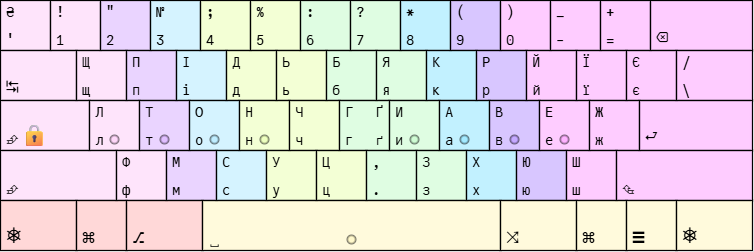

## ergoLAY3

Ранній ручний експеримент.

Внутрішня назва: `leus3.ua.ansi`. [Файл імпорту](../layouts/early/ergoLAY3/ergoLAY3.uk.ansi.txt).

## ergoLAY4

Ранній ручний експеримент.

Внутрішня назва: `leus4.ua.ansi`. [Файл імпорту](../layouts/early/ergoLAY4/ergoLAY4.uk.ansi.txt).

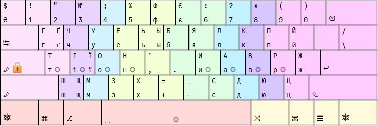

## ergoLAY5

Ранній ручний експеримент.

Внутрішня назва: `leus5.ua.ansi`. [Файл імпорту](../layouts/early/ergoLAY5/ergoLAY5.uk.ansi.txt).

## ergoLAY6

Ранній ручний експеримент.

Внутрішня назва: `leus6.ua.ansi`. [Файл імпорту](../layouts/early/ergoLAY6/ergoLAY6.uk.ansi.txt).

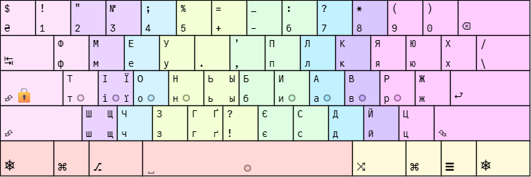

## ergoLAY7

Ранній ручний експеримент.

Внутрішня назва: `leus7.ua.ansi`. [Файл імпорту](../layouts/early/ergoLAY7/ergoLAY7.uk.ansi.txt).

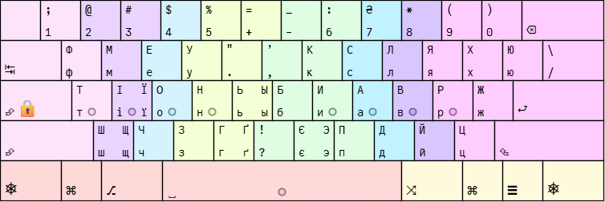

## ergoLAY8

Ранній ручний експеримент.

Внутрішня назва: `leus8.ua.ansi`. [Файл імпорту](../layouts/early/ergoLAY8/ergoLAY8.uk.ansi.txt).

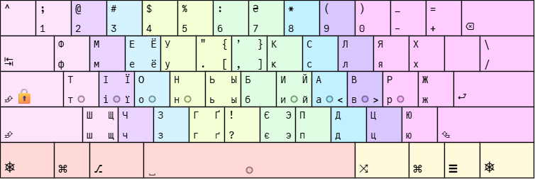

## ergoLAY1g0

Гілка корпусного аналізу з Gephi 0.10.1.

Внутрішня назва: `leus1g.ua.ansi`. [Файл імпорту](../layouts/gephi/ergoLAY1g0/ergoLAY1g0.uk.ansi.txt).

## ergoLAY1g1

Гілка корпусного аналізу з Gephi 0.10.1.

Внутрішня назва: `leus1g1.ua.ansi`. [Файл імпорту](../layouts/gephi/ergoLAY1g1/ergoLAY1g1.uk.ansi.txt).

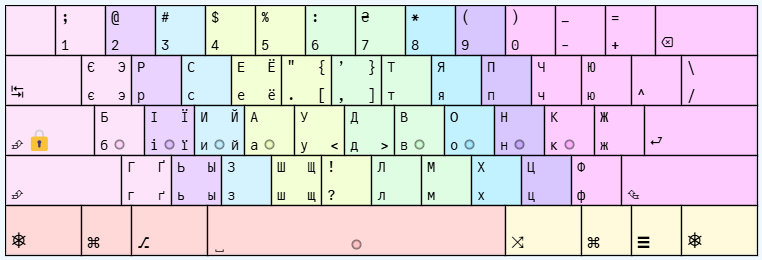

## ergoLAY1g2

Гілка корпусного аналізу з Gephi 0.10.1.

Внутрішня назва: `leus1g2.ua.ansi`. [Файл імпорту](../layouts/gephi/ergoLAY1g2/ergoLAY1g2.uk.ansi.txt).

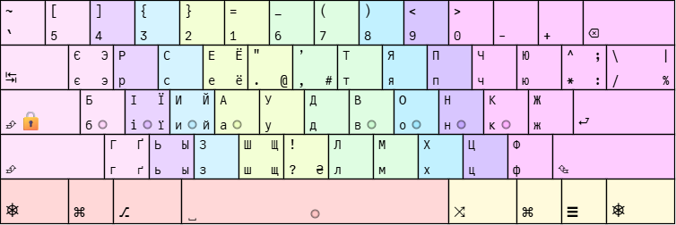

## ergoLAY1g3

Гілка корпусного аналізу з Gephi 0.10.1.

Внутрішня назва: `leus1g3.ua.ansi`. [Файл імпорту](../layouts/gephi/ergoLAY1g3/ergoLAY1g3.uk.ansi.txt).

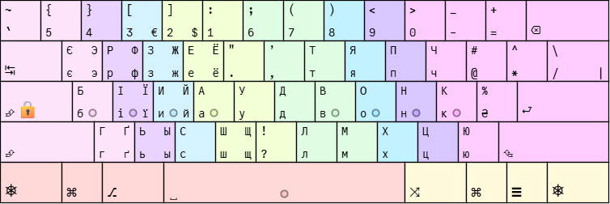

## ergoLAY1g4

Гілка корпусного аналізу з Gephi 0.10.1.

**Основна версія, яку автор використовує щодня.**

Внутрішня назва виправленого імпорту: `LTleus1g4.ua.ansi`. [Файл імпорту](../layouts/gephi/ergoLAY1g4/ergoLAY1g4.uk.ansi.txt).

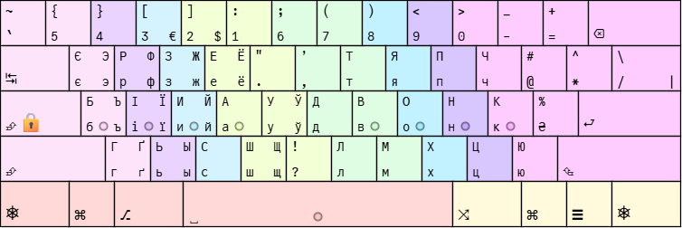

Прев’ю застаріле лише щодо відомого порядку `%`/`₴`: у виправленому імпорті та KLC `%` на основному шарі, `₴` на Shift.

## ergoLAY1a0

baseline-0.1: контрольна реконструкція вихідної схеми зі скриншота; відрізняється від наданого ergoLAY1g4.

Внутрішня назва: `ergolay.uk.ansi.baseline-0.1`. [Файл імпорту](../layouts/ai/ergoLAY1a0/ergoLAY1a0.uk.ansi.txt).

## ergoLAY1a1

minimal-0.1: варіант із трьома обмінами літер.

Внутрішня назва: `ergolay.uk.ansi.minimal-0.1`. [Файл імпорту](../layouts/ai/ergoLAY1a1/ergoLAY1a1.uk.ansi.txt).

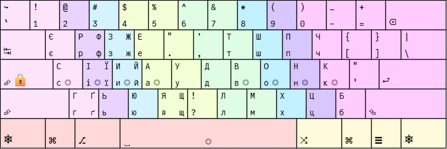

## ergoLAY1a2

prototype-0.1: вільна оптимізація літер, початковий файл імпорту.

Внутрішня назва: `ergolay.uk.ansi.prototype-0.1`. [Файл імпорту](../layouts/ai/ergoLAY1a2/ergoLAY1a2.uk.ansi.txt).

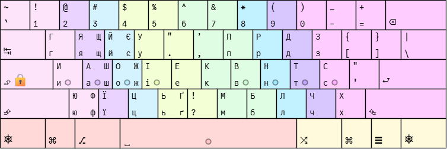

## ergoLAY1a3

LTprototype-0.1: ті самі позиції українських літер, що в ergoLAY1a2, але змінені символи й пробіл на лівому пальці; збережена вхідна схема подальших розрахунків.

Внутрішня назва: `LTprototype-0.1`. [Файл імпорту](../layouts/ai/ergoLAY1a3/ergoLAY1a3.uk.ansi.txt).

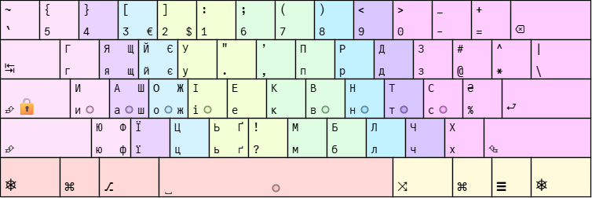

## ergoLAY1a4

0.2-minimal: модель із Shift, AltGr, пробілами та пунктуацією; обмежені зміни літер.

Внутрішня назва: `LTprototype-0.2-minimal`. [Файл імпорту](../layouts/ai/ergoLAY1a4/ergoLAY1a4.uk.ansi.txt).

Прев’ю ще не надано.

## ergoLAY1a5

0.2-full: ширша перестановка літер у моделі з модифікаторами.

Внутрішня назва: `LTprototype-0.2-full`. [Файл імпорту](../layouts/ai/ergoLAY1a5/ergoLAY1a5.uk.ansi.txt).

Прев’ю ще не надано.

## ergoLAY1a6

0.3-altgr: основний шар LTprototype-0.1 збережено; пошук розміщення шести літер серед 13 лівих AltGr-позицій.

Внутрішня назва: `LTprototype-0.3-altgr`. [Файл імпорту](../layouts/ai/ergoLAY1a6/ergoLAY1a6.uk.ansi.txt).

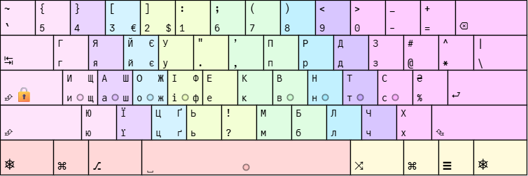

## ergoLAY1a7

0.3-full: пошук на основному шарі та 13 дозволених AltGr-позиціях.

Внутрішня назва: `LTprototype-0.3-full`. [Файл імпорту](../layouts/ai/ergoLAY1a7/ergoLAY1a7.uk.ansi.txt).

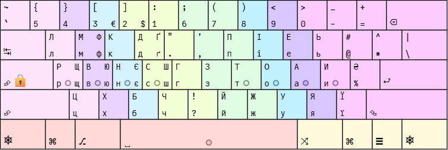

## ytsuken

Звична українська ЙЦУКЕН для порівняння.

Внутрішня назва: `йцукен.укр.ansi`. [Файл імпорту](../layouts/reference/ytsuken/ytsuken.uk.ansi.txt).

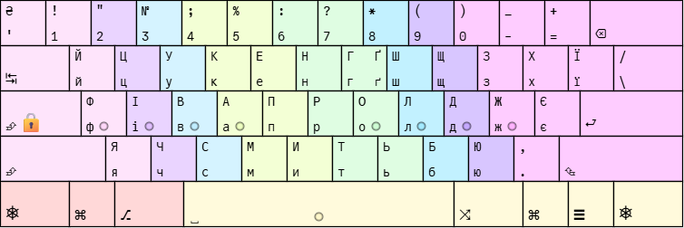
