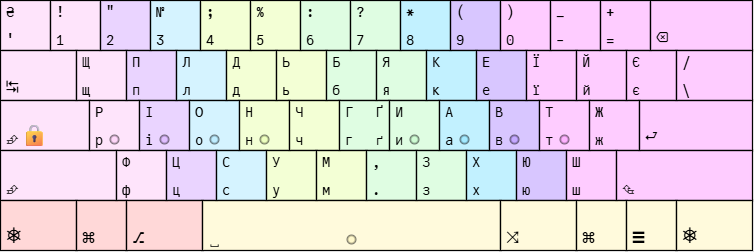
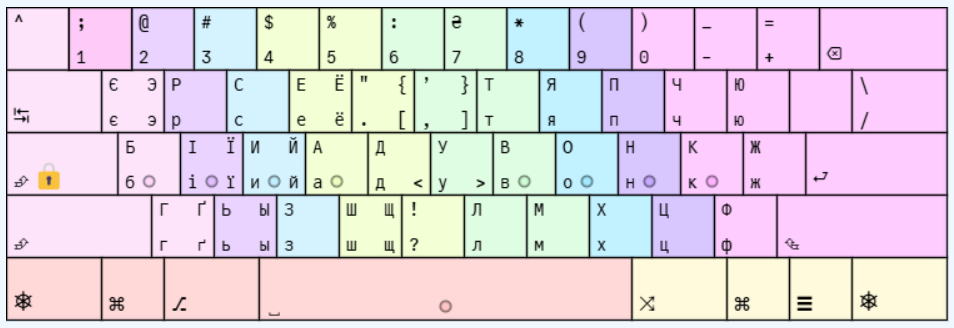
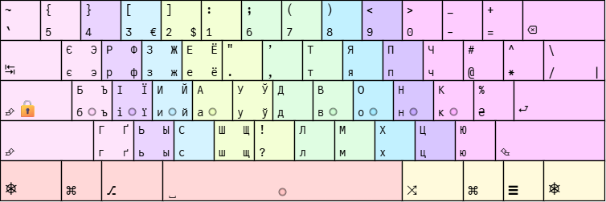

# Версії та прев’ю

**KLANext** - файли для імпорту в [аналізатор розкладок](https://klanext.keyboard-design.com/). **MSKLC** - проєкти для редагування. **Windows** — інсталятори.

| Версія | KLANext | MSKLC | Windows | Прев’ю |
| --- | --- | --- | --- | --- |
| 0 | [TXT](layouts/no-ai/ergoLAY0/ergoLAY0.uk.ansi.txt) | — | — | [PNG](layouts/no-ai/ergoLAY0/ergoLAY0.png) |
| 2 | [TXT](layouts/no-ai/ergoLAY2/ergoLAY2.uk.ansi.txt) | — | — | [PNG](layouts/no-ai/ergoLAY2/ergoLAY2.png) |
| 3 | [TXT](layouts/no-ai/ergoLAY3/ergoLAY3.uk.ansi.txt) | — | — | [PNG](layouts/no-ai/ergoLAY3/ergoLAY3.png) |
| 4 | [TXT](layouts/no-ai/ergoLAY4/ergoLAY4.uk.ansi.txt) | — | — | [PNG](layouts/no-ai/ergoLAY4/ergoLAY4.png) |
| 5 | [TXT](layouts/no-ai/ergoLAY5/ergoLAY5.uk.ansi.txt) | — | — | [PNG](layouts/no-ai/ergoLAY5/ergoLAY5.png) |
| 6 | [TXT](layouts/no-ai/ergoLAY6/ergoLAY6.uk.ansi.txt) | — | — | [PNG](layouts/no-ai/ergoLAY6/ergoLAY6.png) |
| 7 | [TXT](layouts/no-ai/ergoLAY7/ergoLAY7.uk.ansi.txt) | — | — | [PNG](layouts/no-ai/ergoLAY7/ergoLAY7.png) |
| 8 | [TXT](layouts/no-ai/ergoLAY8/ergoLAY8.uk.ansi.txt) | — | — | [PNG](layouts/no-ai/ergoLAY8/ergoLAY8.png) |
| 1g0 | [TXT](layouts/no-ai/ergoLAY1g0/ergoLAY1g0.uk.ansi.txt) | [KLC](layouts/no-ai/ergoLAY1g0/ergoLAY1g0.klc) | [ZIP](installers/ergoLAY1g0-windows.zip) | [PNG](layouts/no-ai/ergoLAY1g0/ergoLAY1g0.png) |
| 1g1 | [TXT](layouts/no-ai/ergoLAY1g1/ergoLAY1g1.uk.ansi.txt) | [KLC](layouts/no-ai/ergoLAY1g1/ergoLAY1g1.klc) | [ZIP](installers/ergoLAY1g1-windows.zip) | [PNG](layouts/no-ai/ergoLAY1g1/ergoLAY1g1.png) |
| 1g2 | [TXT](layouts/no-ai/ergoLAY1g2/ergoLAY1g2.uk.ansi.txt) | — | — | [PNG](layouts/no-ai/ergoLAY1g2/ergoLAY1g2.png) |
| 1g3 | [TXT](layouts/no-ai/ergoLAY1g3/ergoLAY1g3.uk.ansi.txt) | — | — | [PNG](layouts/no-ai/ergoLAY1g3/ergoLAY1g3.png) |
| 1g4 | [TXT](layouts/no-ai/ergoLAY1g4/ergoLAY1g4.uk.ansi.txt) | [KLC](layouts/no-ai/ergoLAY1g4/ergoLAY1g4.klc) | [ZIP](installers/ergoLAY1g4-windows.zip) | [PNG](layouts/no-ai/ergoLAY1g4/ergoLAY1g4.png) |
| 2a0 | [TXT](layouts/ai/ergoLAY2a0/ergoLAY2a0.uk.ansi.txt) | — | — | [PNG](layouts/ai/ergoLAY2a0/ergoLAY2a0.png) |
| 2a1 | [TXT](layouts/ai/ergoLAY2a1/ergoLAY2a1.uk.ansi.txt) | — | — | [PNG](layouts/ai/ergoLAY2a1/ergoLAY2a1.png) |
| 2a2 | [TXT](layouts/ai/ergoLAY2a2/ergoLAY2a2.uk.ansi.txt) | — | — | [PNG](layouts/ai/ergoLAY2a2/ergoLAY2a2.png) |
| 2a3 | [TXT](layouts/ai/ergoLAY2a3/ergoLAY2a3.uk.ansi.txt) | — | — | [PNG](layouts/ai/ergoLAY2a3/ergoLAY2a3.png) |
| 2a4 | [TXT](layouts/ai/ergoLAY2a4/ergoLAY2a4.uk.ansi.txt) | — | — | — |
| 2a5 | [TXT](layouts/ai/ergoLAY2a5/ergoLAY2a5.uk.ansi.txt) | — | — | — |
| 2a6 | [TXT](layouts/ai/ergoLAY2a6/ergoLAY2a6.uk.ansi.txt) | — | — | [PNG](layouts/ai/ergoLAY2a6/ergoLAY2a6.png) |
| 2a7 | [TXT](layouts/ai/ergoLAY2a7/ergoLAY2a7.uk.ansi.txt) | — | — | [PNG](layouts/ai/ergoLAY2a7/ergoLAY2a7.png) |

## 0

Перші експерименти.

## 8

Завершення етапу ручних перестановок.

## 1g0

Перехід до корпусного аналізу та Gephi.

## 1g4

Моя основна розкладка.

## 2a2

Перший вдалий варіант, створений за допомогою ШІ на основі 1g4.

## 2a7

Останній варіант, у якому ШІ перебудував усю розкладку з нуля.

